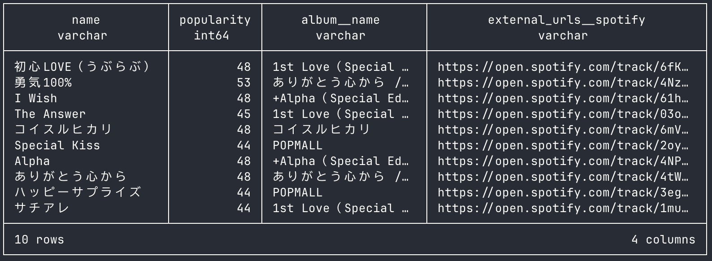
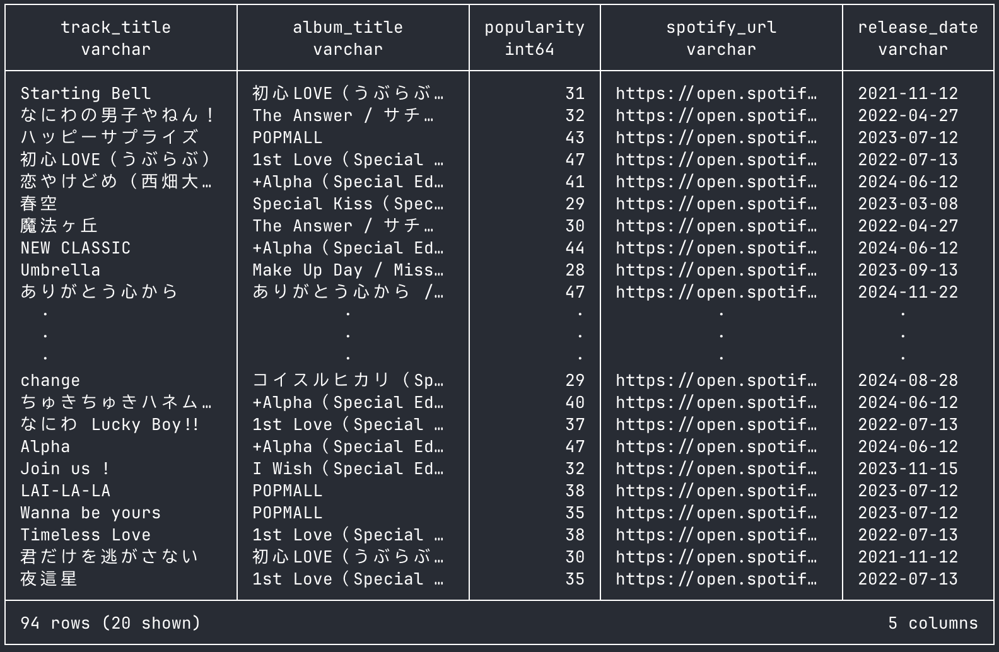

# dlt→dbt example: Spotify Web API to DuckDB

This repository is a small example for dltHub of extracting Spotify data to DuckDB.

The example gets the tracks for なにわ男子 (Naniwa Danshi). For more information on Spotify's API, read the [reference](https://developer.spotify.com/documentation/web-api/reference/get-track).


## Quick Start
### Spotify Web API to DuckDB
1. Install the required packages.
    ```bash
    pip install -r requirements.txt
    ```
2. Set the Spotify's client ID and client secret in `.env`, like a [`.env.example`](spotify_duckdb/.env.example)
3. Extract data from Spotify to DuckDB. When you run it, you will get a duckdb file.
   ```bash
   python spotify_duckdb/spotify_to_duckdb.py
   ```
4. Show pipeline
   ```bash
   dlt pipeline spotify_api_example show
   ```
5. Check DuckDB
   ```bash
   python spotify_duckdb/check_duck_db.py
   ```
   or Check on a SQL editor, like a DBeaver
   ```sql
   select
       name, popularity, album__name, external_urls__spotify
   from naniwa_danshi.track_details
   ```
   You can get the following results:
   

### Transform tables on DuckDB
1. Fix `~/.dbt/profiles.yml` as below:
   ```yaml
   <dbt project name>:
     outputs:
       dev:
         type: duckdb
         path: <path to spotify_api_example.duckdb>
         threads: 1
   
       prod:
         type: duckdb
         path: <path to spotify_api_example.duckdb>
         threads: 4
   
     target: dev
   ```
2. Move to `dbt_duckdb/spotify_duckdb`
   ```bash
   cd dbt_duckdb/spotify_duckdb
   ```
3. Create mart table using dbt
   ```bash
   dbt run
   ```
4. Check the mart table
   ```bash
   python spotify_duckdb/check_mart.py
   ```
   You can get the following results:
   

## Requirements
- Python 3.11
- dlt
- pandas
- streamlit
- dbt-core
- dbt-duckdb
   