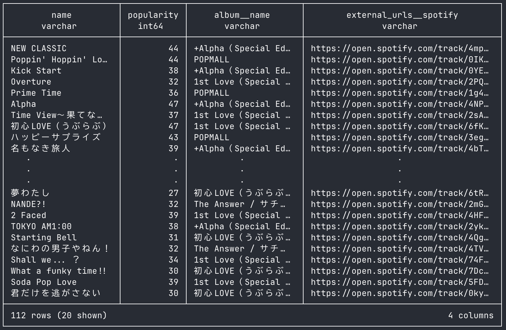

# dltHub example: Spotify Web API to DuckDB

This repository is a small example for dltHub of extracting Spotify data to DuckDB.

The example gets the top tracks in Japan for なにわ男子 (Naniwa Danshi). For more information on Spotify's API, read the [reference](https://developer.spotify.com/documentation/web-api/reference/get-an-artists-top-tracks).


## Quick Start
1. Install the required packages.
    ```bash
    pip install -r requirements.txt
    ```
2. Set the Spotify's client ID and client secret in `.env`, like a [`.env.example`](./.env.example)
3. Extract data from Spotify to DuckDB. When you run it, you will get a duckdb file.
   ```bash
   python spotify_to_duckdb.py
   ```
4. Show pipeline
   ```bash
   dlt pipeline spotify_api_example show
   ```
5. Check DuckDB
   ```bash
   python check_duck_db.py
   ```
   or Check on a SQL editor, like a DBeaver
   ```sql
   select
       name, popularity, album__name, external_urls__spotify
   from naniwa_top_tracks.top_tracks
   ```
   You can get the following results:
   

## Requirements
- Python 3.11
- dlt
- pandas
- streamlit
   